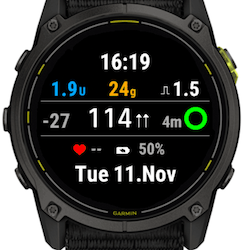
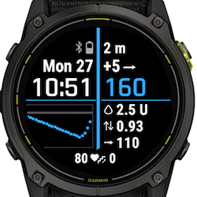
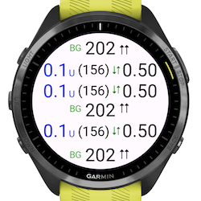
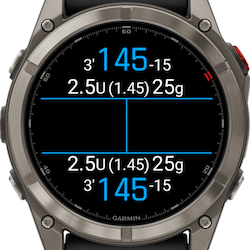

# Garmin apps for Trio

The repository contains information about watchfaces and datafields for Garmin usable with Trio. they are [available in connectIQ](https://apps.garmin.com/de-DE/developer/eae8d754-7a90-4cc7-85f1-95d12ea93490/apps)

The apps requires a large PR applied to Trio, which is not yet done. In the meanwhile you can use the branch [feat/Garmin from my Trio](https://github.com/mountrcg/Trio/tree/feat/garmin) repo or the [Tai dev](https://github.com/mountrcg/tai/tree/Tai-dev) branch.

For collaborators code is found at:
| App | Screen |
| -- | -- |
| [Trio Original Watchface](https://github.com/mountrcg/Trio-Original-Watchface) |  |
| [Swissalpine Watchface](https://github.com/mountrcg/Trio-Swissalpine-Watchface) |  |
| [Trio Original Datafield](https://github.com/mountrcg/Trio-Original-Datafield) |  |
| [Swissalpine Datafieldk](https://github.com/mountrcg/Trio-Swissalpine-Datafield) |  |